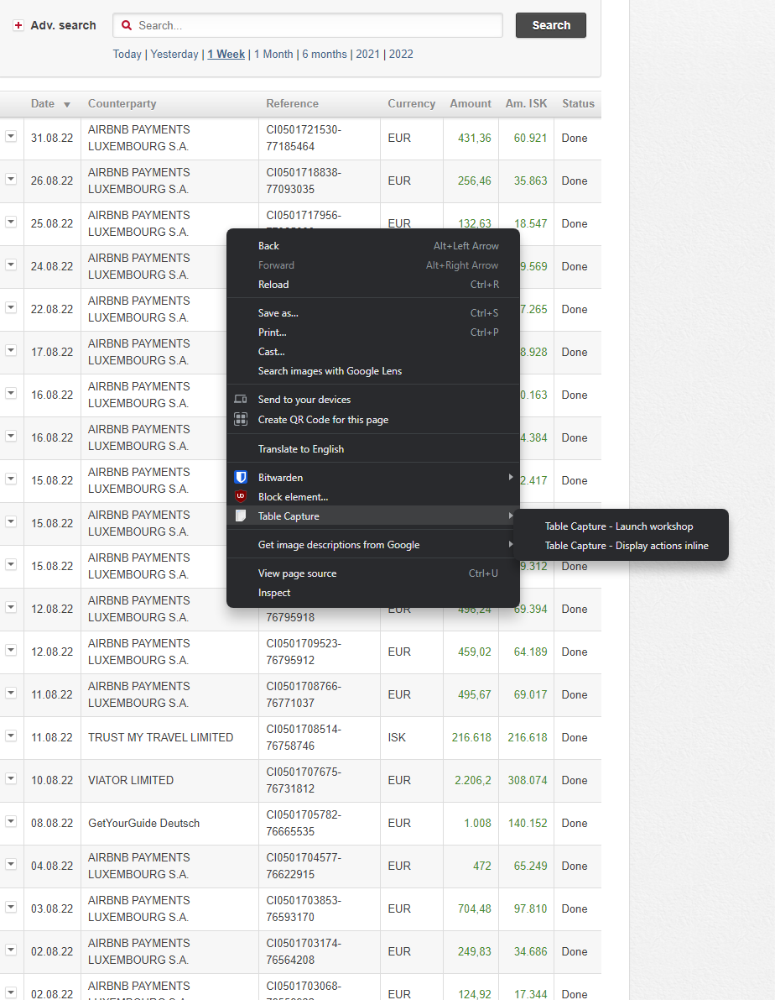
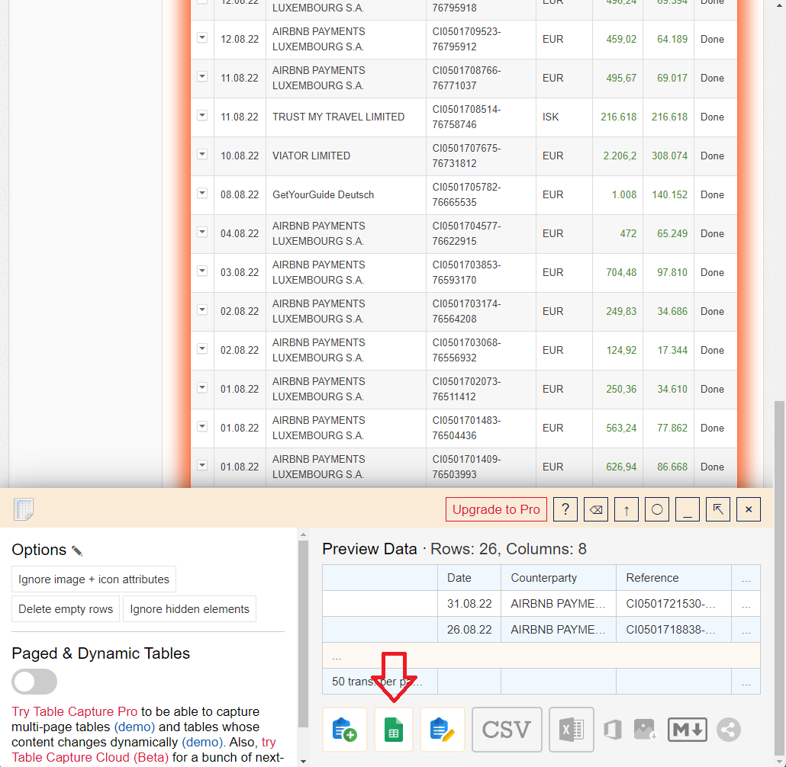
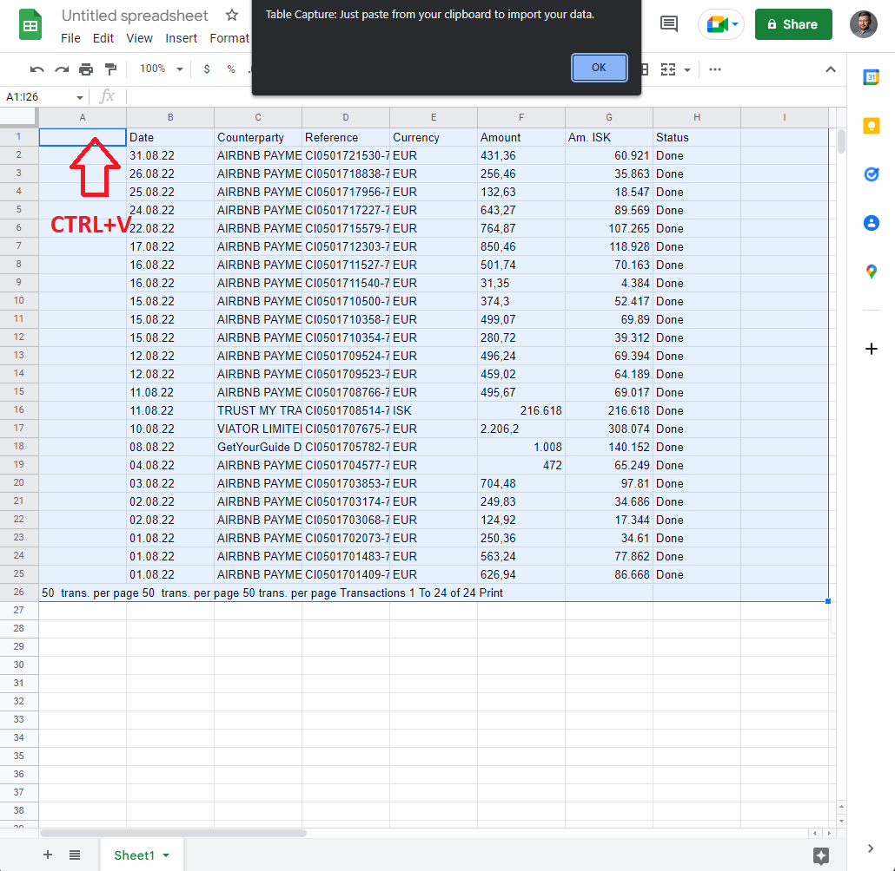
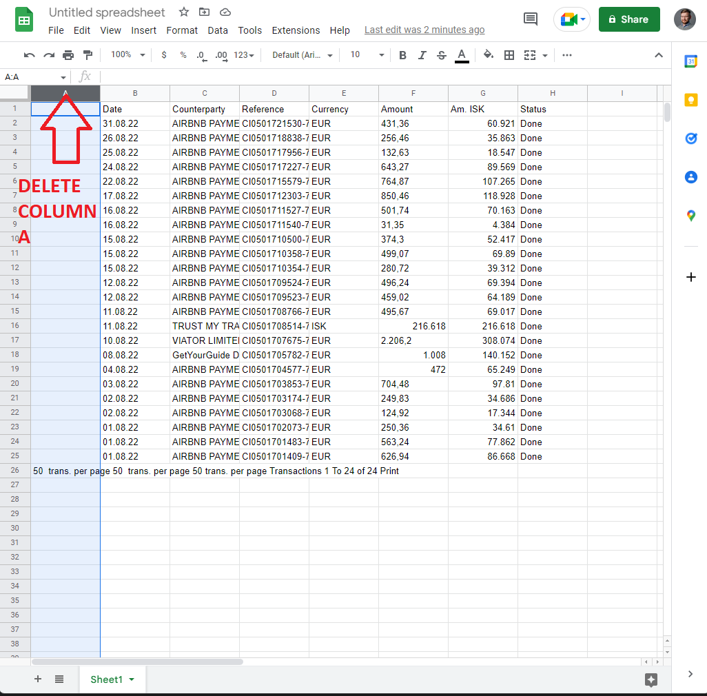
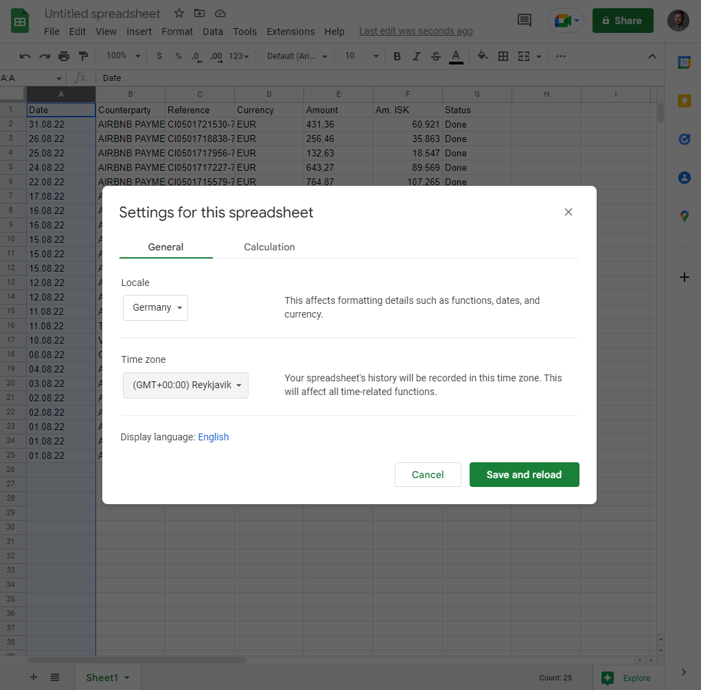

# Journal Generator

.NET 6 Console Application that converts statement for international payment from Íslandsbanki online bank to a Payday journal import file.

## Setup Install

Make sure you have [.NET 6 SDK](https://docs.microsoft.com/en-us/dotnet/core/tutorials/with-visual-studio-code?pivots=dotnet-6-0#:~:text=The-,.NET%206%20SDK.,-Create%20the%20app) installed.


To run the app run in .NET CLI:
```
dotnet run
```

[Further installation guide](https://docs.microsoft.com/en-us/dotnet/core/tutorials/with-visual-studio-code?pivots=dotnet-6-0)


## How to export Islandsbanki international statement for international payment

### Step 1. Table Capture browser extension
Make sure you have Table Capture browser extension installed.
 * [Google Chrome](https://chrome.google.com/webstore/detail/table-capture/iebpjdmgckacbodjpijphcplhebcmeop?hl=en)
 * [Firefox](https://addons.mozilla.org/en-US/firefox/addon/table-capture-firefox/)
 * [Microsoft Edge](https://microsoftedge.microsoft.com/addons/detail/table-capture/cjlemjohnmihejeecaoaglgejaokmclj)


### Step 2. Export the statement using Table Capture
Right click the table and select *Table Capture > Table Capture - Launch workshop* 



### Step 3 Select Google Spreadsheets



### Step 4. Paste the table in Google Spreadsheets
Paste the table that has been automatically been saved in your clipboard into cell *A1*


### Step 5. Delete Column A



### Step 6. Make sure you are using European standards in numbers and dates.
Best way to ensure you are using the date and number standards that is supported in Iceland is to go to the file settings and select Germany as your locality.



### Example file
You can see how the input file should look like if you open up [Journal.xlsx](example files/Journal.xlsx). 